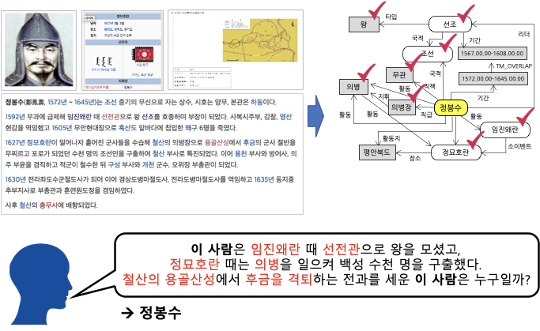

# BoostCamp AI Tech: KLUE Relation Extraction Competition


[발표자료](https://github.com/boostcampaitech3/level2-klue-level2-nlp-07/blob/master/Images/nlp07_KLUE_%E1%84%87%E1%85%A1%E1%86%AF%E1%84%91%E1%85%AD.pdf)

<br/>
<br/>

# 대회 개요

<p align="center"></p>

문장 속에서 단어간에 관계성을 파악하는 것은 의미나 의도를 해석함에 있어서 많은 도움을 준다.

그림의 예시와 같이 요약된 정보를 사용해 QA 시스템 구축과 활용이 가능하며, 이외에도 요약된 언어 정보를 바탕으로 효율적인 시스템 및 서비스 구성이 가능하다.

- 관계 추출(Relation Extraction)은 문장의 단어(Entity)에 대한 속성과 관계를 예측하는 문제이다. 관계 추출은 지식 그래프 구축을 위한 핵심 구성 요소로, 구조화된 검색, 감정 분석, 질문 답변하기, 요약과 같은 자연어처리 응용 프로그램에서 중요하다. 비구조적인 자연어 문장에서 구조적인 triple을 추출해 정보를 요약하고, 중요한 성분을 핵심적으로 파악할 수 있다.

이번 대회에서는 문장, 단어에 대한 정보를 통해 ,문장 속에서 단어 사이의 관계를 추론하는 모델을 학습시킨다. 이를 통해 우리의 인공지능 모델이 단어들의 속성과 관계를 파악하며 개념을 학습할 수 있다. 

- 클래스 정보: 총 30개의 Class
<p align="center"></p>

- Baseline 디렉토리 구조
    
    ```
    ├── code
    │   ├── __pycache__
    │   ├── best_model
    │   ├── logs
    │   ├── prediction
    │   └── results
    └── dataset
        ├── test
        └── train
    ```
    
- Baseline 파일 포함 디렉토리 구조
    
    ```
    ├── code
    │   ├── __pycache__
    │   │   └── load_data.cpython-38.pyc
    │   ├── best_model
    │   ├── dict_label_to_num.pkl
    │   ├── dict_num_to_label.pkl
    │   ├── inference.py
    │   ├── load_data.py
    │   ├── logs
    │   ├── prediction
    │   │   └── sample_submission.csv
    │   ├── requirements.txt
    │   ├── results
    │   └── train.py
    └── dataset
        ├── test
        │   └── test_data.csv
        └── train
            └── train.csv
    ```
    

# 2주동안 수행한 작업들

- 그라운드 룰 정하기
<p align="center"></p>


- EDA
    - 간단한 EDA 및 분포
    - .csv에서 entity 입력 부분에 type이 저장되어 있어, Entity CLUE로서 부여: sub [SEP] obj
- Taxt Data Augmentation
    - ktextaug 라이브러리를 이용한 한국어 augmentation
    - 한국어 맞춤법을 망가뜨리는 형식의 노이즈 추가.
- Special Token
    - 오피스 아워에서 힌트를 얻어 entity special token를 실험
        - [An Improved Baseline for Sentence-level Relation Extraction(2019)](https://arxiv.org/pdf/2102.01373v3.pdf)
        - Entity Marker(punct), Typed entity marker 실험 시도
- 모델
    - 모델 선택
        - klue/bert-base, klue/roberta-small, klue/roberta-base, klue/roberta-large
        - ko-ELECTRA
    - 모델 아키텍처 수정
        - klue/bert-base, klue/roberta-large
- TAPT
- 편의성 개선
    - 깃허브 레포 체계적 관리(master - feature 브렌치로 구성)
        - 깃허브 PR 양식 설정하고, 깃허브 master branch에 PR 및 push하면 Slack에 알림
    - 쉘 스크립트를 활용한 하이퍼 파라미터 관리
    - Slack Workflow 알람
        - 매일 오후 9시, 추가적인 제출을 원하는 인원 파악

# 실패(그렇게 2주가 흘러갔습니다...)
<p align="center"></p>
<br/>
## 각성

- 멘토님의 조언
    - 제대로 된 이유가 없이 그저 리더 보드의 지표 만을 올리기 위한 비교 실험 같다.
    - Task와 관련된 논문을 제대로 읽어보지 않은 느낌이다.
    - 모델, Task, 데이터의 특성을 정확히 이해하지 못한 느낌이다.

## 원인 분석

- Metric에 대한 이해 부족
    - 오로지 F1만 바라보고 달려옴 → 실제로는 F1, AUPRC, Loss 등 모든 것이 중요했다
- 논문에 대한 이해 부족
    - 좋은 성능을 낸, 따라할만해 보이는 논문을 아무런 분석과 인사이트 없이 그저 따라서 구현만 함.
- Github으로 협업하기 <절망편>
    - 팀원들과 반성하며 중간 결산 코드 업데이트를 하던 중 special entity token 관련 실험하던 코드가 이전 버전으로 덮어 씌워진 것을 발견함.
    - 그렇게 2주동안 의미 없는 실험을 했다는 것을 깨닫고 상심하여 울기도 함.
- Backtranslation의 entity 손상 가능성을 두려워 해서 시도해 보지도 않았다
    - 토론 게시판에 공유된 정보만 취하고, 이를 실제로 구현하지 않음
- 하이퍼파라미터 튜닝을 게을리 하였다
    - 직전 대회의 경험이 치명적으로 다가옴 (기본 모델 맹신과 하이퍼 파라미터 중요하게 생각 X)
- 모델에 대한 고려 부족
    - bert-base 모델만 활용하여 실험을 진행하였는데, 조언 이후 roberta-large 모델에서도 실험
    - Roberta-large로 실험을 하려니 시간이 오래 걸리게 되어 저번 이미지 대회 팀에서 python lightning AMP를 활용하신게 기억나서 huggingface에도 비슷한 기능이 없나 찾아보게 되었다. → fp16을 알게 되었다. (공식 문서의 중요성을 한번더 느낌)

# 5일간의 버닝

- 하이퍼 파라미터 튜닝
    <p align="center"></p>
    
    - max_len 128 설정(논문 설정), fp16 사용 → 실험 시간 대폭 단축
    - 현재까지 실험 모델 중 성능이 가장 좋은 roberta-large를 선택
    - klue/roberta-large의 논문에서 사용했던 하이퍼 파라미터를 위주로 다시 실험
    - LR  이 터닝 포인트
    - Focal loss (gamma 실험)
    - warmup ratio, weight decay, dropout = 0.0 세팅으로 지나친 일반화 억제
- Augmentation
    - Backtranslation: googletrans 라이브러리 활용,  한→영→한 번역을 거친 데이터셋 약 4만여개 확보(ver1: 번역 전 entity들을 특수 문자로 치환하여 보존, ver2: 통짜 번역 후 entity 원형이 보존된 것만 픽업)
- Special Token(Entity Marker) 적극 도입
    - [An Improved Baseline for Sentence-level Relation Extraction(2019)](https://arxiv.org/pdf/2102.01373v3.pdf)를 참고, special token 추가 여부에 대한 성능 분석
    - 논문에서는 기존 연구를 바탕으로 새로운 Entity Type을 제안
        <p align="center"></p>
        
        - 실험(Roberta-Large)
            - punctuation: `[CLS] sub [SEP] obj [SEP] a b c @ sub @ d e # obj # f g [SEP]`
            - entity token: `[CLS] sub [SEP] obj [SEP] a b c <S:NER_TYPE> sub </S:NER_TYPE> d e <O:POS_TYPE> obj </O:POS_TYPE> f g [SEP]`
            - typed entity marker(punct): `[CLS] sub [SEP] obj [SEP] a b c @ * SUB_NER * sub @ d e # ^ OBJ_NER ^obj # f g [SEP]`
        - 분석
            - 논문에서 말하고 있는대로 Entity를 함께 주었을 때 성능이 월등히 좋았음
                - Entity Type이 관계를 이해하는데 도움을 준다.
            - Entity 위치와 type을 한꺼번에 주는게 아니라 각각 따로 표시해주는 것이 성능 향상에 더 좋았음.

- Entity type 유형 및 모델 실험
    <p align="center"></p>

    <p align="center"></p>

- 질문형 문장
    - 첫주차 오피스 아워에서 힌트를 얻어 실험(Single vs Multi)
        - 두가지 문장을 함께 입력 받는 BERT의 구조를 그대로 가져갈 수 있도록 raw sentence 뒤에 문장을 하나 더 붙여주면 어떨까?
        
        <p align="center"></p>

        - 문장 뒤에 해당 질문 추가:
            - `[CLS] sub [SEP] obj [SEP] a b c @ * SUB_NER * sub @ d e # ^ OBJ_NER ^ obj # f g [SEP] 이 문장에서 sub 와(과) obj 은(는) 어떤 관계일까? [SEP]`
            - 추가해준 경우 성능이 향상
    - 그렇다면 질문으로 들어가는 내용도 중요하게 작용할까?
        - 질문
            - 이 문장에서 sub와(과) obj 은(는) 어떤 관계일까?
            - **에서 sub 와(과) obj 은(는)?**
            - 에서 sub 와(과) obj의 관계는?
            - In this sentence, what is relationship between sub and obj?
            - In this sentence, sub and obj are?
        - 결과
            - 문장(sentence), 관계(relationship)과 같이 의미가 있는 단어가 함께 들어가는 경우 일반화 부분에서 성능 하락
                - 즉, raw sentence에 영향을 주지 않은 불용어 위주로 구성된 문장일수록 일반화가 더 잘 됨
            - 한글 데이터셋으로 학습된 klue/roberta-large 모델을 썼음에도 불구하고 영어로 문장을 넣어주었을 때도 좋은 성능을 보임
                - 약간의 노이즈로 작용해 오버피팅을 막아주고 일반화에 좋은 영향을 미친 것으로 분석
- Model Architecture
    - 현재는 맨 앞의 [CLS] 토큰만을 이용해 분류를 진행
    - An Improved Baseline for Sentence-level Relation Extraction(2019)의 경우, Entity Token Embedding을 이용해 분류를 진행하고 있음.
        - 이를 바탕으로 모델 구조 수정
        - Subject Entity의 시작과 끝 토큰, Object의 시작과 끝 토큰을 concat해서 사용
    - 결과:
        - start token만 넣어주었을 때 보다 end token을 함께 넣어주었을 때 성능이 향상됨
            - (Start, End) 토큰을 함께 줌으로써 해당 문장에서 Entity의 범위에 대한 정보를 모델이 분류에 사용할 수 있기 때문이라 분석됨.
        - 같은 setting에서도 [CLS] 토큰을 함께 concat 시켜주는 경우에는 성능이 떨어짐.
            - 즉, 문장 전체에 대한 정보를 함께 넣어주는 경우 성능이 떨어진 것을 확인할 수 있었음.
            - 관계 추출 task에서는 문장에 대한 이해 보다는 해당 Entity의 정보에 대한 이해가 더 중요한 것으로 보임.
- ETC(그 외에도 여러 방법들을 시도해 보았습니다)
    - k-fold
    - spelling noise
    - TAPT
    - 모델 output 한 뒤에 LSTM 적용하여 클래스 분류

# Ensemble
 <p align="center"></p>

- 여러 조합으로 제출한 모델 중 서로 특징이 다른 탑 7을 모아서 soft-voting average 앙상블 시도

# 최종 결과
<p align="center"></p>
<p align="center"></p>
<br/>
<p align="center"></p>


# 깨달은 점

- Metric에 대한 더 깊은 이해를 하게 되었음
    - Loss, F1, Auprc 모두 고려하며 상황을 추론하자
- 일반화의 방향성에 대해 생각하게 되었음
    - 이미 Test 셋이 어느정도 bias가 있는 상황에서 과한 일반화는 독이 된다
- 하이퍼 파라미터란 무엇인가에 대해 생각하게 되었음
    - 최고를 찾으려는 것 보다, 상황 마다의 최선의 선택을 하려 노력하는 것이 중요
    - 내가 쓰는 모델의 특성을 충분히 이해하자
    - 하이퍼 파라미터 별 특성도 이해하자
    - 이러한 다각적 이해가 뒷받침 되면 하이퍼 파라미터 튜닝에 쏟는 시각이 비약적으로 줄어들 것

# 개인 회고

## 🧭학습목표

### 팀 공통 학습목표

- Text Data Augmentation 경험
- Github으로 협업하는 방법 익히기
- Huggingface 자유롭게 사용하기

### 개인 학습

- 한글 text data augmentation 조사 & 적용
- 쉘스크립트 도입으로 실험 간편 & 자동화
- 체계적인 WandB 세팅으로 실험 추적 편리성 추구
- VScode의 git 관리 툴을 이용한 코드 버전 관리
- 공식문서를 다독하며 Huggingface 기반 코드 커스터마이징

### 공동 학습

- 데일리 스크럼, 피어세션을 통해 팀원의 진척도 확인과 트러블슈팅
- 과거 경험과 논리에 기반한 인사이트 제공으로 학습 방향 조정
- 팀 슬랙 채널을 이용한 깃허브 수정 기록 관리, 일일 제출 수요 조사
- Validation set, metric 고정으로 팀 내 분석 방법 통일
- 자잘한 실험은 개인 로그, 중요한 실험만 팀 로그에 기록하며 실험 기록 아카이빙

## 📖사용한 지식 & 기술

- Pre-trained LM: (KLUE)Bert, (KLUE)RoBERTa, koElectra
- Loss Function: Cross-Entropy, Focal Loss
- Transfer Learning 기법: Fine-Tuning
- 데이터셋 재정립: Sklearn의 StratifiedShuffleSplit을 이용한 라벨 별 균등 비율 분리 → validation set 제작, 중복 데이터 제거, 미스라벨링 교정
- Augmentation: 모음 변형에 의한 노이즈, 음운변화에 의한 노이즈, 한→영→한 Backtranslation
- Metric: F1 Score, AUPRC
- Ensemble: Soft Voting
- Hyperparameter Tuning: batch size, epoch, learning rate, warmup rate, dropout, weight decay

## 🧑🏻‍🎓결과 ⇒ 깨달음

- RoBERTa-large 모델에 backtranslation을 적용한 증강 데이터가 포함된 학습 데이터로 최적의 하이퍼 파라미터를 세팅 하여 fine-tuning 한 결과물이 팀 내 단일 모델 기준 2위를 달성하였다.
    - 논문을 기반으로 선택한 적절한 모델을 사용하면, 하이퍼 파라미터만 적절히 세팅 해 줘도 높은 퍼포먼스를 달성할 수 있음을 깨달았다.
- Backtranslation을 적용한 증강 데이터로 학습한 모델을 앙상블에 넣었을 때 효과가 있었다.
    - 학습한 데이터만 달라져도 모델이 데이터를 바라보는 시각이 달라짐을 확인할 수 있었다.

## 🛠️새롭게 시도한 변화 ⇒ 효과

- 대회 초창기에 EDA와 간단한 모델을 통해 테스트 하면서 최대한 리더보드와 유사한 기준점이 되는 Metric을 확립하였다.
    - 실험의 신뢰성을 확보할 수 있었고, 동료들과의 커뮤니케이션에도 도움이 되었다
- 새로운 라이브러리, 환경을 사용하는 것에 거부감을 가지지 않았다.
    - huggingface 뿐만 아니라, ktextaug나 googletrans 같은 데이터 증강에 필요한 외부 라이브러리를 빠르게 도입하여 작업시간을 단축할 수 있었다.
- 새로운 방법을 제안하거나 반대할 때, 논리 이외에도 실증을 통해서 증명하려 노력했다.
    - 증명을 위한 실험 과정에서 새로운 결론이 도출 → 추가 실험 등의 꼬리에 꼬리를 무는 유기적인 실험이 저절로 구성되었고, 이는 남을 설득할 때 더 튼튼한 근거가 되었다.
- 외부 함수를 쓰기 전에 기술 문서와 다른 사람의 코드를 보며 충분히 이해한 후 사용하려 노력했다.
    - 함수를 잘못 써서 일어나는 사고가 현저히 감소하였고, 코드에 대한 이해도 또한 상승하여 남을 더 잘 도와줄 수 있었다.

## 🏗️실수 & 한계 ⇒ 개선 방안

- 대회 끝까지 완벽하게 독립성이 확보된 eval 데이터셋 분리에 실패했다.
    - 다음 프로젝트부턴 하드코딩을 하는 한이 있더라도 데이터에 쓰는 시간을 늘려야겠다.
- Augmentation 기법 중 가장 간단한 backtranslation을 그냥 토론 게시판만 보면서 entity 손상 가능성으로 인한 수율 불안정성을 두려워 해서 시도조차 안 하려 했다.
    - 결과가 불안해 보이는 시도라도 초반에 최대한 해 보면서 인사이트를 얻으려 노력해야겠다.
- 깃허브 코드 관리를 팀 단위로 유기적으로 진행하려 했지만, 마지막 3주차에선 거의 하지 못했다.
    - 프로젝트 그라운드 룰로 매 저녁마다 코드 업데이트를 시행하는 것을 고려 중이다.
- 쉘스크립트 도입을 통한 실험 간편화까진 고안했지만, 이를 통한 실험 자동화로 밤새 실험을 많이 돌릴 수 있단 사실을 뒤늦게 알았다.
    - 변화가 가져온 이득에 만족하며 안주하지 않고, 더더욱 발전하려 노력하는 자세를 길러야겠다.

## 🆕다음 프로젝트에서 새롭게 시도해볼 것들

- 컨피그 파일을 이용한 하이퍼 파라미터 세팅
- 쉘스크립트를 사용한 실험 자동화
- 더 정밀한 EDA를 통한 독립성이 완전 보장된 eval 셋 분리
- 더욱 체계화된 팀 코드 관리
